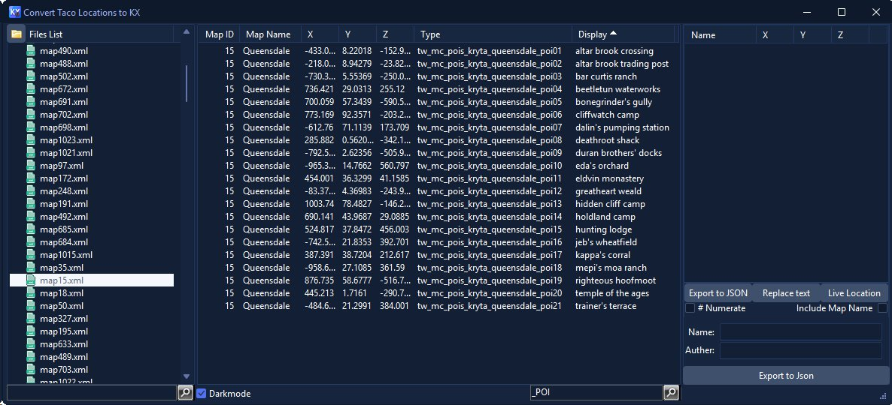

# Taco2KX – TACO to KX Converter

  

## GUI Preview

  

## What is TACO to KX Converter?

**Taco2KX** A Windows desktop application that converts TACO (Tactical Overlay) marker files to the KX format. This tool streamlines the process of building custom JSON files for teleport locations for the KX tool.

### Features

- **TACO File Processing**: Drag-and-drop support for .taco archive files containing XML marker data
- **Coordinate Conversion**: Automatically converts TACO coordinates to KX format
- **Live Player Monitoring**: Real-time player position tracking via **MumbleLink** integration
- **Interactive Preview**: Visual list view showing converted coordinates with location information
- **Search & Filter**: Real-time filtering for both file lists and map data
- **JSON Export**: Export converted markers to JSON format for use with other tools
- **Dark Mode**: Modern dark theme support with Windows 11 styling

## Souce code Dependancys
	[MustangpeakEasyListView](https://github.com/pyscripter/MustangpeakEasyListView).